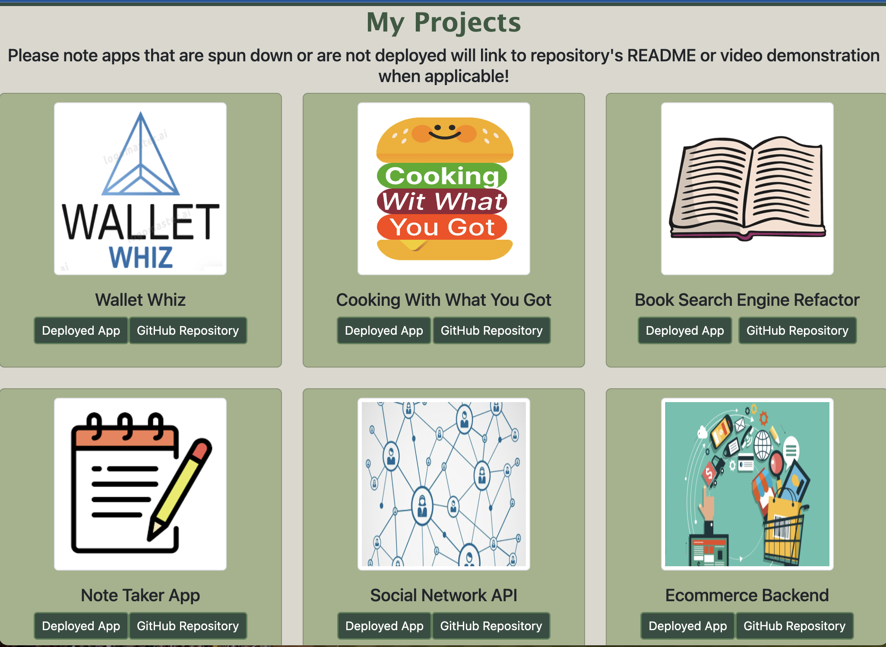
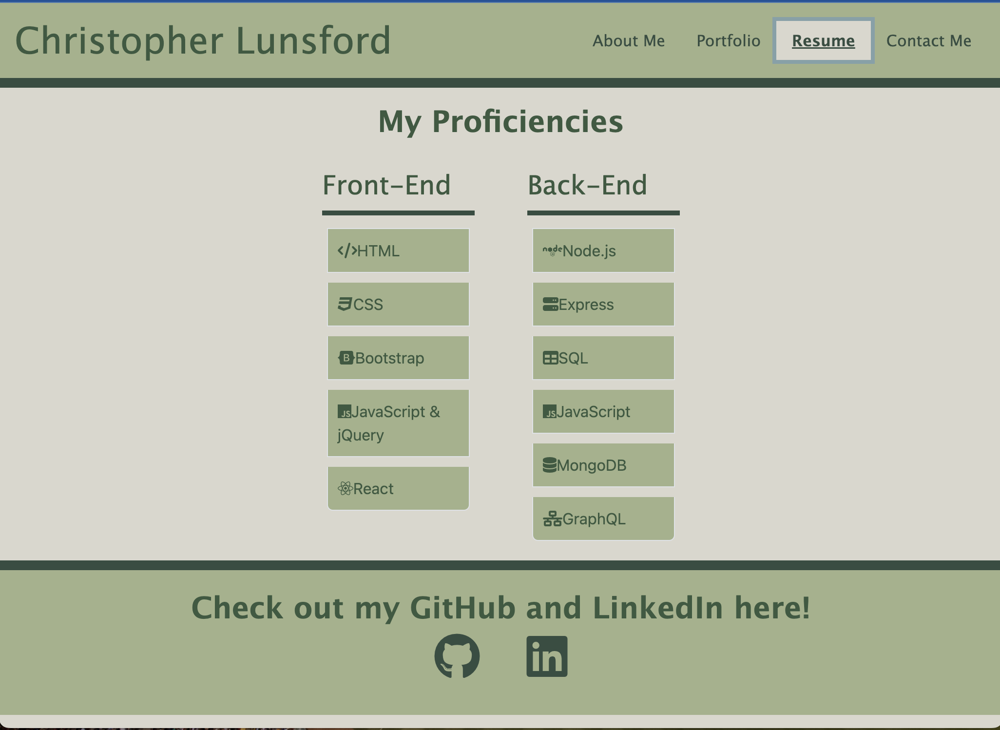
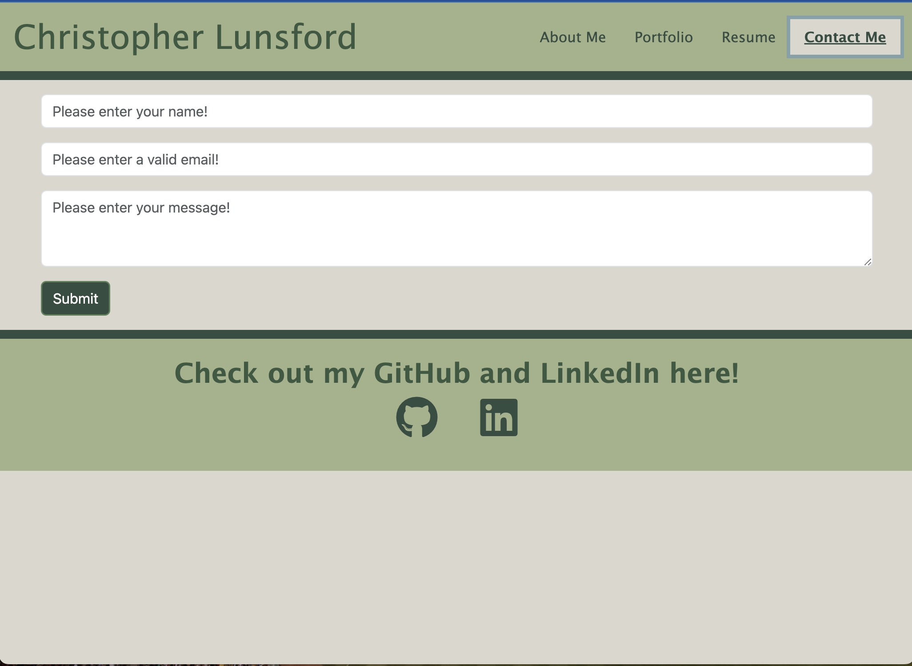

# React Portfolio
## Table of Contents
[Description](#description)
[Link to Webpage](#link-to-webpage)
[Screenshots](#screenshots)
[Questions](#questions)

## Description
This webpage is a portfolio site that I made for myself. The purpose of the site is to give a brief description about me and my coding ability, display links to projects that I have worked on, and provide links to my GitHub and LinkedIn. The about me section on the homepage gives a short paragraph on my level of skill in coding and experience. The nav links in the site's header link to additional pages for viewing projects I have worked on, which languages I am proficient in, and a contact form. Links to my GitHub and LinkedIn can be found in the footer. This site was created using React and is styled using Boostrap and CSS.

## Link to Webpage
Click [here](https://christopherlunsford.netlify.app/contact) to visit my portfolio page!

## Screenshots

## Questions
Please direct questions to [https://github.com/cslunsford](https://github.com/cslunsford) at [christopher.lunsford@uconn.edu](christopher.lunsford@uconn.edu).